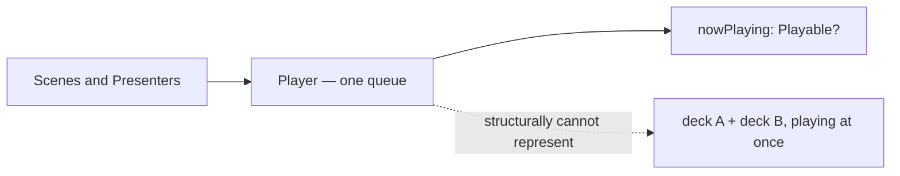
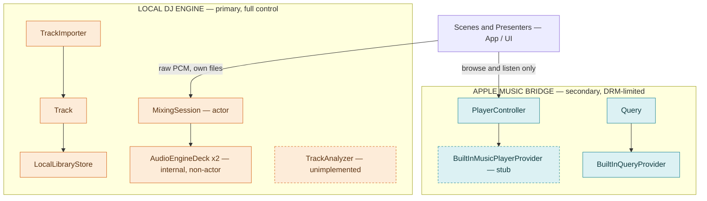
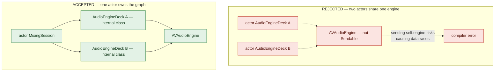
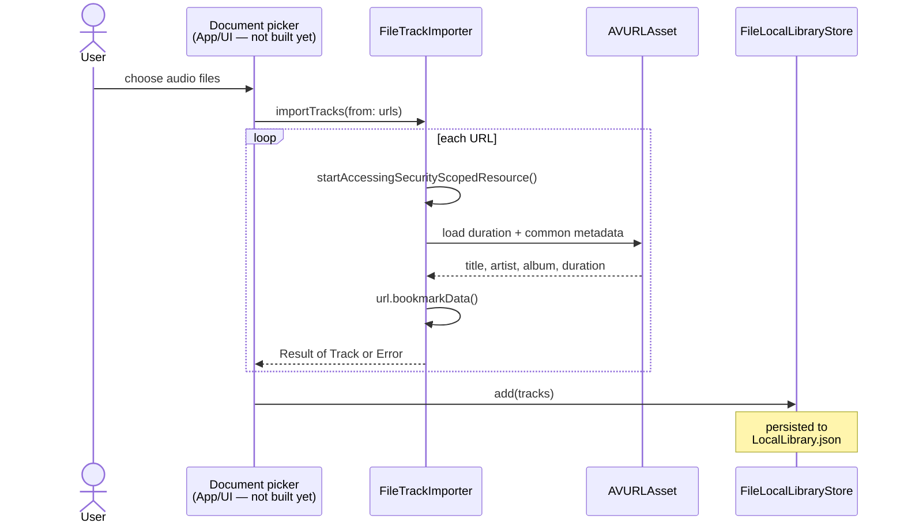
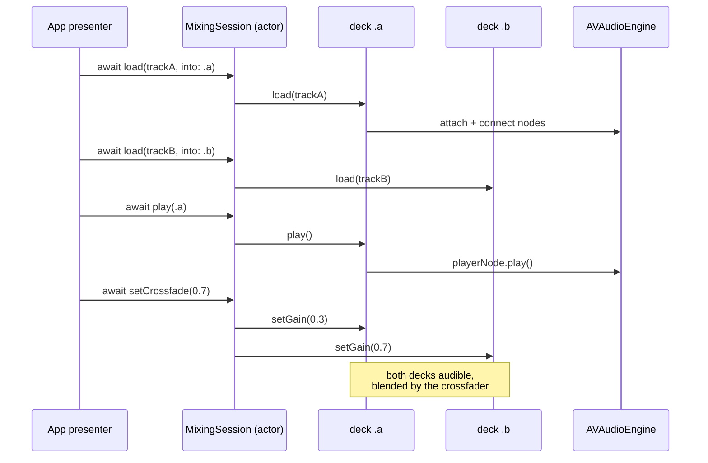

# Core architecture, in diagrams

A visual companion to [`docs/agents/architecture.md`](agents/architecture.md)
and [`docs/agents/viability.md`](agents/viability.md) — same content, drawn
out. Renders directly on GitHub (these are plain Mermaid fences).

## 1. What the old model couldn't do

Before this re-architecture, `Core` had one playback abstraction: `Player` —
a single queue, skip next/previous, one `nowPlaying`. Fine for a
Music.app-style player; structurally incapable of two decks playing into a
crossfader at once, which is the entire point of a DJ app.

## 2. The split: local engine primary, Apple Music a bridge

Local files are fully controllable — raw PCM via `AVAudioEngine`, so cue
points, tempo, gain, and true simultaneous playback are all possible. Apple
Music catalog tracks are DRM-protected — Apple's own player is the only
legal path to them, a single black-box stream by platform policy, not by
choice. The single-queue shape that was wrong for decks is exactly right for
that bridge, so it moved rather than got rewritten. See
[`docs/agents/viability.md`](agents/viability.md) for the full reasoning.

Dashed outline = scoped but not implemented (`TrackAnalyzer`,
`BuiltInMusicPlayerProvider`).

## 3. Why one actor, not two

First pass gave each deck its own `actor`, both holding a reference to one
shared `AVAudioEngine`. Swift 6 rejected it: `AVAudioEngine` isn't
`Sendable`, and nothing stops two actors from touching the same mutable
graph from different threads at once — the compiler is right to refuse
that. The fix isn't a suppression, it's a smaller graph of authority: one
actor owns the entire engine and both decks; the decks themselves become
plain internal classes that only that actor ever touches. See
`Core/AudioEngine/MixingSession.swift`'s header comment for the same
reasoning in prose, and
[`docs/agents/conventions.md`](agents/conventions.md#swift-6-concurrency)
for the general pattern.

## 4. Signal flow: importing a track

Nothing on iOS grants ambient filesystem access, so a file has to be
explicitly picked, bookmarked, and read for metadata before it becomes a
`Track` the library can hold onto across launches. The picker UI itself is
the one piece not built yet — `FileTrackImporter` is ready to receive
whatever URLs it's handed.

One `Result` per file — a bad track in a batch import doesn't sink the rest.

## 5. Signal flow: mixing two decks

Every call into `MixingSession` crosses an actor boundary, so it's
`await`-ed from the app side — the same serialization that made the
engine-sharing problem in section 3 disappear is what makes this safe to
call from a SwiftUI presenter without any manual locking.

## 6. Status board

What actually runs today versus what's scaffolded for later. Kept in sync
with [`docs/agents/state.md`](agents/state.md) — that file is the source of
truth if the two ever disagree.

| Component | Status | Note |
|---|---|---|
| `MixingSession` / `AudioEngineDeck` | ✅ Implemented | Real `AVAudioEngine` graph; not yet exercised against a live file in a running app. |
| `Track` / `FileTrackImporter` | ✅ Implemented | Bookmark + `AVAsset` metadata. No picker UI feeding it yet. |
| `FileLocalLibraryStore` | ✅ Implemented | JSON file under Application Support. Nothing reads from it yet. |
| `TrackAnalyzer` (BPM / key) | 🟠 Scoped, not built | Protocol exists; `UnimplementedTrackAnalyzer` always returns nothing. No first-party API, real DSP work. |
| `BuiltInQueryProvider` | ✅ Implemented | Wraps `MPMediaQuery` — system Music library, not arbitrary files. |
| `BuiltInMusicPlayerProvider` | 🔴 Stub | `Query` doesn't retain the `MPMediaItem` needed to build a real queue yet. |
| Document picker / import UI | ⬜ Not built | App/UI concern, deliberately out of this pass. |
| Deck / mixer screen | ⬜ Not built | No SwiftUI surface calls into `MixingSession` yet. |
